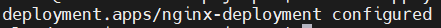
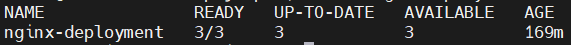

# Contents
[Installation and Setup	2](#_toc143013280)

[Configuring the deployment	2](#_toc143013281)

[Configuring a Service	4](#_toc143013282)

[Testing the deployment	5](#_toc143013283)

# Installation and Setup

1.  Install Virtual Box : <https://www.virtualbox.org/wiki/Downloads>
    and Vagrant :
    <https://developer.hashicorp.com/vagrant/downloads?product_intent=vagrant>

2.  Add VBoxManage.exe to the environment variable on the host machine
    (since vagrant scripts need to communicate with VBoxManage.exe to
    create VMs).

> 
>
> To determine the path of VBoxManage.exe go to properties of Virtual
> Box in the target section and copy the stated path to the environment
> variables.

3.  Clone the GitHub repository which includes the vagrant file (script
    to automate creating VMs with Kubernetes services preinstalled):
    <https://github.com/techiescamp/vagrant-kubeadm-kubernetes> .

4.  Navigate to the directory of the vagrant file after cloning the repo
    and run the command: vagrant up (to start running the script that
    automates creating the VMs previously mentioned).

# Configuring the deployment

1.  Navigate to virtual box and access the machine via the vagrant
    credentials, username: vagrant, password: vagrant or you can access
    it through SSH, command: ssh vagrant@machine_ip

2.  Create the nginx deployment YAML file:

3.  This YAML file is equivalent to a service descriptor specifying that
    3 pods of nginx containers will be created with the nginx image
    (pushed to docker hub) and the container port.

4.  Kind: deployment (specifies resource type), name in the metadata
    field gives a name for the deployment, labels: app : nginx applies a
    label nginx to the deployment, this label is used to select pods
    managed by the deployment. Spec section specifies the desired state
    and configuration details. Replicas: 3, this specifies that the
    deployment must maintain 3 pods of the application instances, 3
    identical instances of nginx application running. The selector
    defines the criteria for selecting which pods are part of this
    deployment. matchLabels should match the fields in the metadata
    field. Spec before the container field specifies the template
    desired for the configuration of the pods.

5.  Create the deployment by running the YAML file through the kubectl
    command: kubectl create -f nginx-deployment.yaml

6.  After creating the deployment this response should be generated for
    a successful deployment.

7.  To ensure that the deployment pods are created and running
    successfully you can use: kubectl get deploy.

Here we can see the 3 pods are ready, available, and up to date.

# Configuring a Service

At this point, the deployment is running successfully, the pods
containing the containers are created, but we cannot access the hosted
website directly since it's only accessible through the pods network.

To establish an endpoint, so that we can access the hosted website, we
need to create a service of type node port.

1.  To create a service, we must create a YAML file with the
    configuration of the service.

2.  The kind: Service defines the resource type; a service is an
    abstraction that enables network access to a set of pods in
    Kubernetes.

3.  The type nodePort means that the service will be accessible on a
    specific port across all nodes in the Kubernetes cluster.

4.  Selector: set of labels used to select which pods the service should
    rout traffic too, app: nginx this label selector indicates that the
    service should direct traffic to pods with the label app set to
    nginx. Thus, the name field under spec must be the same as the one
    in the deployment YAML file for the service to work correctly and
    establish and endpoint.

5.  Ports: specifies the ports to expose on the service, the first port
    field for the port exposed in the container, the target port field
    means that the incoming traffic on the service port 80 should be
    forwarded to the port 80 on the pods (target port and port must not
    be the same, but it's assigned the same port by convention). Node
    port assigns a specific port on all nodes in the cluster. Any
    incoming traffic to this port on any node will be forwarded to the
    pods selected by the label selector. (If the target port is omitted,
    then the target port and the port field will be set to the same
    number automatically).

# Testing the deployment

After establishing an endpoint to access the website hosted on the
Kubernetes cluster (all the website files are included in the docker
image of the containers) , we can test that everything is working now.

1.  We can test to see the awaited response by using curl.

2.  Curl is a cli tool that can send http request and receive a
    response, through which we are going to send an http request to the
    endpoint of the cluster and look at the response given back.

3.  To use curl, first find the IP of the endpoint by using the command:
    kubectl describe services \<name_of_service\> , in our case the name
    in the metadata field was my-service so this is the name of the
    service.

> 

4.  Here we can determine that 3 endpoints were established with 3
    different Ips (for 3 pods).

5.  Finally, to test the deployment choose any of the endpoints IP and
    test it using curl by executing the command: curl
    \<endpoint\>:\<target port\> in our case 172.16.0.135:80 is the
    chosen endpoint IP and the target port.

6.  Executing the command should result in your HTML file used for the
    website to be shown in the terminal. 
> Congratulations you have finished the deployment of your static html
> website using nginx and Kubernetes !
